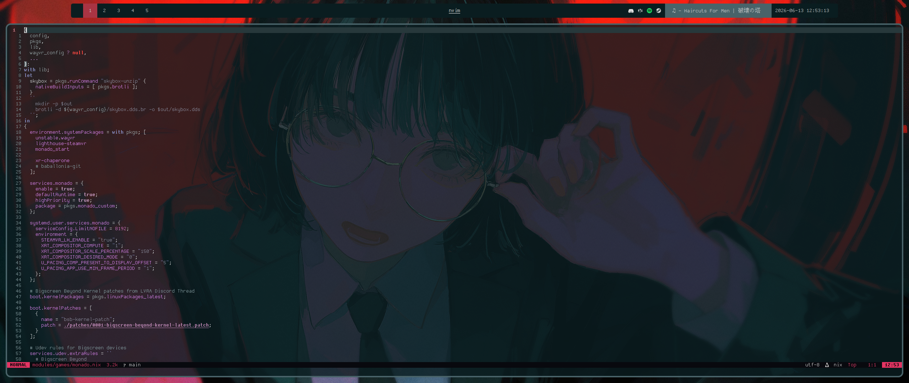

# NixOS

This is my personal NixOS config.
Feel free to look around and whatever.

## More about this

- Wayland + Niri
- No home-manager (i just dont like it)
- Monado + WayVR for VR
- cwal for themeing
- custom nix-fs package for .config files
- Quickshell for bar, widgets and wallpaper picker

## Looks

